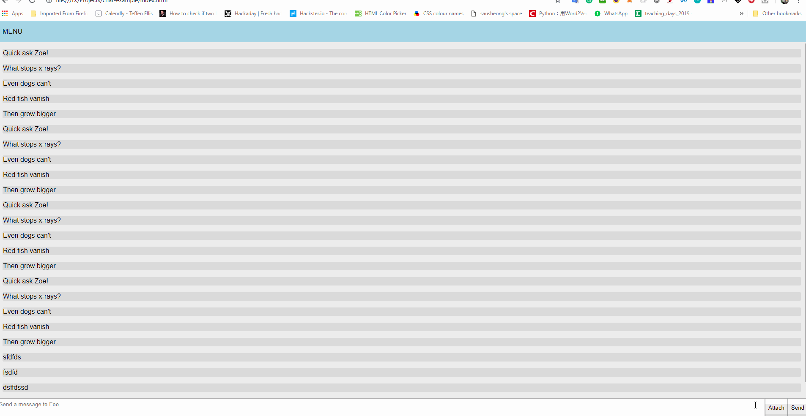

## Build a chat app using Flexbox



(Flexbox Tutorial)[https://flexboxfroggy.com/]

```html
<html lang="en">
<head>
    <meta charset="UTF-8">
    <meta name="viewport" content="width=device-width, initial-scale=1.0">
    <meta http-equiv="X-UA-Compatible" content="ie=edge">
    <title>Chat-Example</title>
    <script src="https://code.jquery.com/jquery-3.3.1.min.js" integrity="sha256-FgpCb/KJQlLNfOu91ta32o/NMZxltwRo8QtmkMRdAu8=" crossorigin="anonymous"></script>
    <link rel="stylesheet" type="text/css" href="index.css">
</head>
<body>
    <main>
        <header class="site-menu">
          MENU
        </header>
        
        <div class="chat-messages">
          <div class="chat-message">Quick ask Zoe!</div>
          <div class="chat-message">What stops x-rays?</div>
          <div class="chat-message">Even dogs can't</div>
          <div class="chat-message">Red fish vanish</div>
          <div class="chat-message">Then grow bigger</div>
          <div class="chat-message">Quick ask Zoe!</div>
          <div class="chat-message">What stops x-rays?</div>
          <div class="chat-message">Even dogs can't</div>
          <div class="chat-message">Red fish vanish</div>
          <div class="chat-message">Then grow bigger</div>
          <div class="chat-message">Quick ask Zoe!</div>
          <div class="chat-message">What stops x-rays?</div>
          <div class="chat-message">Even dogs can't</div>
          <div class="chat-message">Red fish vanish</div>
          <div class="chat-message">Then grow bigger</div>
          <div class="chat-message">Quick ask Zoe!</div>
          <div class="chat-message">What stops x-rays?</div>
          <div class="chat-message">Even dogs can't</div>
          <div class="chat-message">Red fish vanish</div>
          <div class="chat-message">Then grow bigger</div>
        </div>
        
        <div class="chat-input">
          <textarea id="messageField" placeholder="Send a message to Foo"></textarea>
          
          <div class="chat-actions">
            <button type="button">Attach</button>
            <button class="send" type="button">Send</button>
          </div>
      </main>
</body>
</html>
<script type="text/javascript" src="index.js"></script>
```

```javascript
const textarea = document.querySelector('.chat-input textarea')
//const textarea = document.getElementById('messageField');
const sendButton = document.querySelector('button.send')
const chatMessages = document.querySelector('.chat-messages')

function scrollContainerToBottom () {
  const bottomPosition =  chatMessages.scrollHeight - chatMessages.clientHeight  
  chatMessages.scrollTop = bottomPosition
}

function addMessage () {
  const bottomPosition =  chatMessages.scrollHeight - chatMessages.clientHeight
  const containerIsOnBottom = chatMessages.scrollTop === bottomPosition
  const newChatMessage = document.createElement('div')
  newChatMessage.classList.add('chat-message')
  newChatMessage.textContent = textarea.value
  
  chatMessages.appendChild(newChatMessage)
  textarea.value = ''
  

  
  if (containerIsOnBottom) {
    scrollContainerToBottom()
  } else {
    // Show tooltip e.g. "There are {num} new messages!"
  }
}

console.log(textarea);
if (typeof textarea.addEventListener != "undefined") {
    textarea.addEventListener("keyup", event => {
        if (event.keyCode !== 13) return;
        addMessage()
    }, false);
} else if (typeof textarea.attachEvent != "undefined") { //incase you support IE8
    textarea.attachEvent("onkeyup", event => {
        if (event.keyCode !== 13) return;
        addMessage()
    });
}

sendButton.addEventListener('click', addMessage)

scrollContainerToBottom()
```

```css
* {
    box-sizing: border-box;
    /* Apply box-sizing to all elements */
  }
  
  body {
    font-size: 16px;
    font-family: "Helvetica", "Arial", sans-serif;
    margin: 0;
  }
  
  main {
    background: white;
    position: absolute;
    top: 0;
    left: 0;
    right: 0;
    bottom: 0;
    
    display: flex;
    flex-flow: column;
  }
  
  .site-menu {
    width: 100%;
    background: lightblue;
    padding: 1em;
    flex: 0 0 auto;
  }
  
  .chat-messages {
    flex: 1 1 auto;
    overflow-y: scroll;
    background-color: #eee;
  }
  
  .chat-messages .chat-message {
    background: #ddd;
    border: 1px solid #ccc;
    border-radius: 3px;
    margin: 1em;
  }
  
  .chat-input {
    flex: 0 0 auto;
    display: flex;
    background-color: green;
  }
  
  .chat-input textarea {
    flex: 1 1 auto;
    display: block;
    width: 100%;
    font-family: sans-serif;
    padding: .5em;
    resize: none;
  }
  
  .chat-input .chat-actions {
    display: flex;
  }
  
```
